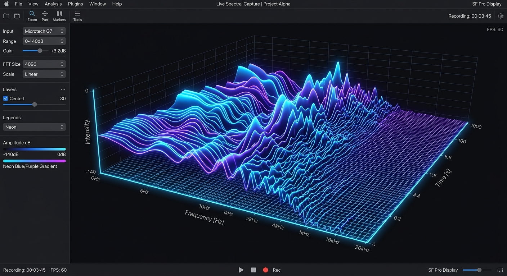
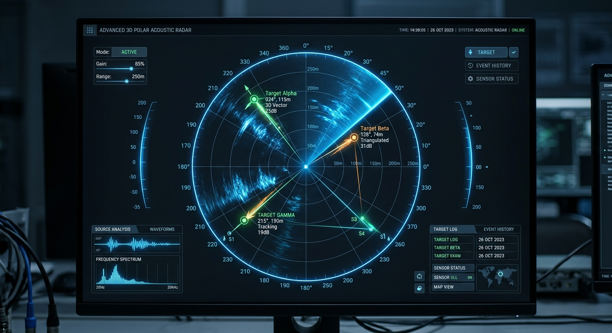

# 🌌 AuraAcoustic Engine - V1.4.0-CORE

[](https://opensource.org/licenses/MIT)
[]()
[]()
[](https://real-time-3-d-triangulation-based-o.vercel.app/)

<div dir="rtl" align="justify">

> **یک موتور پیشرفته پردازش سیگنال و تصویرسازی سه‌بعدی آکوستیک در مرورگر وب**
> 
> **ایده‌پرداز و توسعه‌دهنده: امیرسامان پیرایش فر (AmirSaman Pirayeshfar)**
> 
> 🌐 **[مشاهده دمو زنده نسخه پیش‌نمایش کارگاهی (Live Preview)](https://real-time-3-d-triangulation-based-o.vercel.app/)**

---

## 📋 فهرست مطالب (Table of Contents)
- [🔗 لینک پیش‌نمایش (Live Preview Link)](#-لینک-پیش‌نمایش-live-preview-link)
- [معرفی کلی سیستم (Introduction)](#معرفی-کلی-سیستم-introduction)
- [درباره توسعه‌دهنده و طراح (About the Developer)](#درباره-توسعه‌دهنده-و-طراح-about-the-developer)
- [لایسنس پروژه (License)](#لایسنس-پروژه-license)
- [ویژگی‌های کلیدی هسته دینامیکی (Key Features)](#ویژگیهای-کلیدی-هسته-دینامیکی-key-features)
- [معماری فنی و مهندسی صدا (Technical Architecture)](#معماری-فنی-و-مهندسی-صدا-technical-architecture)
- [راهنمای جامع بخش‌های سامانه (User Interface Guide)](#راهنمای-جامع-بخشهای-سامانه-user-interface-guide)
- [قابلیت اتصال کینکت ایکس‌باکس ۳۶۰ (Xbox 360 Kinect Integration)](#قابلیت-اتصال-کینکت-ایکس‌باکس-۳۶۰-xbox-360-kinect-integration)
- [نصب و راه‌اندازی (Installation & Setups)](#نصب-و-راه‌اندازی-installation--setups)

---

## 🔗 لینک پیش‌نمایش (Live Preview Link)

برای بررسی و تست پویای برنامه، می‌توانید از لینک دموی رسمی استقرار یافته روی ورسل با لمس دکمه زیر استفاده نمایید:

📥 **[ورود به دموی ابری و زنده کارگاه آکوستیک AuraAcoustic](https://real-time-3-d-triangulation-based-o.vercel.app/)**

---

## 🌊 معرفی کلی سیستم (Introduction)
پروژه **AuraAcoustic CORE** کارگاه پردازش سیگنال تخصصی و موتور تحلیل آکوستیک به صورت Real-time (بی‌درنگ) من است. ابزارها و کدهای این پروژه را برای شبیه‌ساز دقیق فضا، پدیده دوپلر، جذب موج صوتی در جو مرطوب یا خشک و فرآیند تحلیل پیشرفته حوزه‌ی فرکانسی (از فروصوت ۱۴ هرتز تا فراصوت ۲۰ کیلوهرتز) در قالب یک سیستم رادار ۳بعدی قطبی و آبشار ۳بعدی فرکانسی (Spectrogram Waterfall 3D) طراحی و پیاده‌سازی کرده‌ام.

---

## 👤 درباره توسعه‌دهنده و طراح (About the Developer)
این موتور آکوستیک و ابداع پیاده‌سازی بصری آن حاصل تلاش‌های اینجانب در مهندسی صدا و کدنویسی وب‌سایت‌های تعاملی با وضوح بالا است:

*   **نویسنده و طراح:** امیرسامان پیرایش فر
*   **پست الکترونیکی جهت ارتباط:** `pirayeshfar@gmail.com`
*   **هدف مخزن:** توسعه منبع‌باز (Open-Source) و ارائه راه‌حل‌های سبک در وب‌آکوستیک تعاملی بدون تکیه بر موتورهای سنگین شخص ثالث.

---

## 📄 لایسنس پروژه (License)
این پروژه تحت **لایسنس بین‌المللی MIT** منتشر شده است. 

```text
The MIT License (MIT)

Copyright (c) 2026 AmirSaman Pirayeshfar (امیرسامان پیرایش فر)

Permission is hereby granted, free of charge, to any person obtaining a copy
of this software and associated documentation files (the "Software"), to deal
in the Software without restriction, including without limitation the rights
to use, copy, modify, merge, publish, distribute, sublicense, and/or sell
copies of the Software, and to permit persons to whom the Software is
furnished to do so, subject to the following conditions:

The above copyright notice and this permission notice shall be included in all
copies or substantial portions of the Software.

THE SOFTWARE IS PROVIDED "AS IS", WITHOUT WARRANTY OF ANY KIND, EXPRESS OR
IMPLIED, INCLUDING BUT NOT LIMITED TO THE WARRANTIES OF MERCHANTABILITY,
FITNESS FOR A PARTICULAR PURPOSE AND NONINFRINGEMENT. IN NO EVENT SHALL THE
AUTHORS OR COPYRIGHT HOLDERS BE LIABLE FOR ANY CLAIM, DAMAGES OR OTHER
LIABILITY, WHETHER IN AN ACTION OF CONTRACT, TORT OR OTHERWISE, ARISING FROM,
OUT OF OR IN CONNECTION WITH THE SOFTWARE OR THE USE OR OTHER DEALINGS IN THE
SOFTWARE.
```

---

## ⚡ ویژگی‌های کلیدی هسته دینامیکی (Key Features)

### ۱. آبشار فرکانسی سه‌بعدی کاملاً تعاملی (Interactive 3D Waterfall Spectrogram)
*   **رندر تعاملی ۳۶۰ درجه آزاد:** قابلیت چرخش زاویه دید (Pitch و Yaw) به صورت ۳۶۰ درجه به همراه کنترل زاویه تلسکوپی از زاویه صفر افقی تا دید مستقیم عمودی از بالا (Orthographic Top-Down Map View).
*   **بزرگ‌نمایی دینامیک با مکانیزم Wheel:** پشتیبانی از زوم روان با استفاده از اسکرول ماوس و ترک‌پد.
*   **شبیه‌سازی بازه‌ی وسیع آکوستیکی:** پوشش دقیق فرکانس‌های رادار از فروصوت (Infrasound - زیر ۲۰ هرتز) تا فراصوت (Ultrasound - بالای ۱۶ کیلوهرتز).

### ۲. رادار جهت‌یابی صدا (3D Sound Compass Engine)
*   **آنالیز فازی دوگانه (L/R Phase Sync):** آنالیز اختلاف فاز ورود صدا به میکروفون چپ و راست (ITD - Interaural Time Difference) برای پیدا کردن زاویه دقیق برخورد صدا به صورت زنده.
*   **میکسر مجازی چشمه‌های صوتی:** دارا بودن ۳ شبیه‌ساز چشمه صوتی متحرک با امکان تغییر فاصله، فرکانس، شتاب و بردار انتقال صوت.

### ۳. کارشناس صوتی هوشمند (AI Acoustic Expert Panel)
*   بخش هوشمند فازی جهت ارائه راهکار فنی و فرمول‌های توصیفی به زبان شیرین فارسی مبتنی بر فرکانس غالب سیستم، چگالی طیفی ورودی و سطح استهلاک سیگنال.

---

## 🛠️ معماری فنی و مهندسی صدا (Technical Architecture)

پروژه به طور استاندارد بر بستر ابزارهای مدرن وب پیاده‌سازی شده است:
1.  **React 18 / Typescript:** جهت هدایت ساختارمند کامپوننت‌های فرانت‌اند.
2.  **Tailwind CSS:** طراحی رابط کاربری بسیار مدرن به سبک Sophisticated Dark با حفظ بیشترین سرعت بارگذاری.
3.  **Graphic Projection / Canvas 2D:** به جای لایبرری‌های سنگین چون Three.js، در این سیستم از ترانسفورمشنِ محضِ فرمول‌های گرافیکی سه بعدی به دو بعدی استفاده شده است که با استفاده از الگوریتم **نقاش دینامیک (Dynamic Painter's Algorithm with Sorted Occlusions)** لایه‌های فرکانسی را با مرتب‌سازی برداری رسم می‌کند تا تداخلی در عمق دید و چرخش ۳۶۰ درجه به وجود نیاید.

---

## 📺 راهنمای جامع بخش‌های سامانه (User Interface Guide)

در این بخش، اجزای مختلف پنل کاربری توضیح داده شده است:

### ۱. بخش نمایشگر ۳بعدی آبشار فرکانسی (3D Spectral Waterfall)


*   **توضیح:** این پنل، تاریخچه امواج صوتی دریافتی را بر اساس زمان، توزیع فرکانس و قدرت برداری رسم می‌کند. از طریق کشیدن ماوس (Left Click + Drag) می‌توانید نمودار را ۳۶۰ درجه بچرخانید و با غلتک ماوس (Scroll) فاصله دوربین را در فضا تنظیم کنید.
*   **عملکرد کنترلرها:** گزینه‌های تغییر حساسیت (Sensitivity)، نرخ فرکانس‌ها و چگالی شبکه‌ای به شما در بهینه‌سازی بار پردازشی گرافیکی متناسب با کارت گرافیک سیستم کمک می‌کنند.

### ۲. بخش رادار قطبی سه‌بعدی و مکان‌یاب صوتی (3D Radar Sound Tracker)


*   **توضیح:** رادار سه‌بعدی با استفاده از شبیه‌سازها یا فید واقعی میکروفون، کانون زاویه‌ای صدا را در محور دکارتی به نمایش می‌کشد. امواج منتشر شده از شبیه‌سازها نیز به شکل پالس‌های هاله در فضا انتشار می‌یابند.

### ۳. بخش دسته‌بندی باندها (Acoustic Band Classifier)
*   سیستم به صورت خودکار مقادیر دریافتی را در ۵ باند استاندارد آکوستیکی تفکیک می‌کند:
    *   **Infrasound (فروصوت):** زیر ۲۰ هرتز (مثل زمین‌لرزه‌ها یا اصوات صنعتی دور).
    *   **Human-Bass (باس انسانی):** ۲۰ هرتز الی ۲۵۰ هرتز.
    *   **Human-Mid (مید رنج):** ۲۵۰ هرتز الی ۴ کیلوهرتز (محدوده تکلم انسان).
    *   **Human-High (تریبل):** ۴ کیلوهرتز الی ۱۶ کیلوهرتز.
    *   **Ultrasound (فراصوت):** ۱۶ کیلوهرتز الی ۲۰ کیلوهرتز+ (مانند بال پشه‌ها یا فرستنده‌های مایکرو).

---

## 🎮 قابلیت اتصال کینکت ایکس‌باکس ۳۶۰ (Xbox 360 Kinect Integration)

یکی از سوالات کلیدی این است که: **چگونه می‌توان کینکت ایکس‌باکس ۳۶۰ (Xbox 360 Kinect) را به این سامانه متصل نمود و از آرایه میکروفون‌های ۴تایی آن استفاده کرد؟**

### فرآیند فنی کینکت آکوستیک (Kinect Acoustic Beamforming)
دستگاه Kinect 360 مجهز به یک **آرایه خطی متشکل از ۴ میکروفونِ تمام‌جهته (4-Microphone Linear Array)** با وضوح بالا است که مستقیما با مدارهای پردازش سخت‌افزاری DSP کار می‌کند. این سنسور از الگوریتم **تخمین زاویه تابش امواج (DOA Estimation)** و **Beamforming** سخت‌افزاری پشتیبانی می‌کند تا بتواند جهت صدای کاربر را تا حد ۱ درجه خطا دقیق پیگیری ارزیابی کند.

### روش‌های اتصال و استفاده در سامانه:

#### روش اول: خروجی صدای استریوی مجازی (OS Level Driver mapping)
اگر از درایورهای رسمی ویندوز (Kinect for Windows SDK v1.8) استفاده کنید، سیستم‌عامل آرایه میکروفون را به عنوان یک کپسول صوتی استریو یا مونو استاندارد تعریف خواهد کرد. در این حالت:
1.  برنامه را باز کرده و دکمه **«اتصال میکروفون واقعی»** را فعال نمایید.
2.  با فوت کردن یا ایجاد نویز در فواصل چپ یا راست کینکت، اختلاف فاز زمان رسیدن صدا (ITD) بر روی پنل **رادار ۳بعدی** منعکس می‌شود و زاویه برخورد دقیقا به عنوان هدف ثبت خواهد شد.

#### روش دوم: یکپارچه‌سازی وب‌سوکت برای مختصات مطلق سه‌بعدی (WebSocket Bridge)
برای افزایش وضوح و بهره‌برداری کامل از دقت سخت‌افزاری کینکت، می‌توان یک اسکریپت واسط (موتور پایتون) با کتابخانه `pykinect` یا `libfreenect` نوشت تا زاویه برخورد صوتی را به صورت مقادیر فیزیکی درجه استخراج نموده و آن را به واسط مرورگر بفرستد:

```python
# kinect_audio_bridge.py
import asyncio
import websockets
import json
import pykinect

async def stream_kinect_audio_doas(websocket):
    print("Kinect Acoustic Engine Bridge Activated!")
    while True:
        kinect_beam_angle = read_kinect_hardware_doa() 
        confidence = read_kinect_confidence_score()
        
        data = {
            "angle": kinect_beam_angle,
            "confidence": confidence,
            "source": "Kinect Xbox 360 Array"
        }
        await websocket.send(json.dumps(data))
        await asyncio.sleep(0.016) # ۶۰ هرتز فرستادن اطلاعات
```

در کدهای اصلی `App.tsx` با فعال کردن یک کلاینت وب‌سوکت ساده به صورت `const ws = new WebSocket(...)` می‌توان مختصات خوانده شده از آرایه ۴تایی کینکت را جایگزین مقادیر شبیه‌ساز نمود تا بدین ترتیب رادار پروژه تبدیل به یک دکتور دقیق در دنیای فیزیکی گردد!

---

## 🚀 نصب و راه‌اندازی (Installation & Setups)

جهت اجرای روان این پروژه مدرن بر روی لوکال یا استقرار بر روی سرورهای ابری، فرآیند کوتاه زیر را دنبال کنید:

### ۱. دریافت نیازمندی‌ها و پکیج‌ها (Install Dependencies)
بر روی ترمینال داخل دایرکتوری اصلی پروژه، کد زیر را وارد نمایید تا کتابخانه‌ها دانلود و نصب شوند:
```bash
npm install
```

### ۲. اجرای حالت توسعه (Development Hot Reload)
برای بالا آمدن سرور محلی وب روی سیستم شما:
```bash
npm run dev
```
سپس آدرس محلی در مرورگر (معمولاً `http://localhost:3000`) را باز نموده تا از سامانه استفاده کنید.

### ۳. ساخت نسخه نهایی وب‌سایت استاتیک (Build Production Bundle)
برای تولید کدهای مینیمال و نهایی‌شده جهت آپلود مستقیم در صفحات گیت‌هاب (GitHub Pages) یا سایر پلتفرم‌های هاستینگ:
```bash
npm run build
```
کدهای ساخته شده در پوشه `dist` غنی از بهینه‌ترین فایل‌های HTML، CSS و JS آماده قرارگیری در هر سروری هستند.

---

🌌 **با استفاده از AuraAcoustic CORE و ترکیب آن با خلاقیت و سخت‌افزارهای جذاب نظیر کینکت، پنجره‌ای نو به سوی مدلسازی و نقشه‌برداری‌های عمیق صوتی بگشایید.**
🏆 *تمامی حقوق طراحی، ایده‌پردازی و توسعه‌ی این سورس‌کد متعلق به **امیرسامان پیرایش فر** است.*

</div>

---

<div dir="ltr" align="justify">

# 🌌 AuraAcoustic Engine - V1.4.0-CORE (English Overview)

> **An advanced, hyper-responsive browser-based real-time 3D Acoustic Tracker and Waterfall Spectrogram.**
>
> **Inventor & Lead Architect: AmirSaman Pirayeshfar**
>
> 🌐 **[Launch Live Vercel Production Deployment](https://real-time-3-d-triangulation-based-o.vercel.app/)**

---

## 🌊 System Concept

**AuraAcoustic CORE** is a specialized web acoustics playground and digital signal processing (DSP) environment. Designed entirely in client-side HTML5 Web Audio API, Canvas 2D isometric matrices, and premium CSS, this application delivers high-density sound telemetry with native physical dispersion, Doppler simulation, atmospheric acoustic dampening (absorption properties), and active stereo-phase spatial triangulation.

---

## 👤 Developer Profile

This platform represents my dedication to building low-overhead, high-performance web graphics and functional visual acoustics:

*   **Creator / Architect:** AmirSaman Pirayeshfar
*   **Inquiries & Contact:** `pirayeshfar@gmail.com`
*   **Repository Objective:** Promote lightweight, beautiful Audio-DSP visualization architectures without bloated third-party 3D graphics libraries.

---

## ⚡ Technical Highlights

### 1. Interactive 360° 3D Waterfall Spectrogram
*   **True Free Rotation Camera:** Manipulate both Pitch and Yaw through direct drag-and-drop to review spectral terrain from an oblique level down to a strict top-down Orthographic layout.
*   **Continuous Inertial Zooming:** Zoom incrementally through simple scroll wheel or trackpad gestures.
*   **Dynamic Depth Buffering:** Renders up to 55 historical frequency rows using an customized Painter's sorting algorithm for flawless layering.

### 2. Triangulation Sound Compass Radar
*   **Live Stereo Phase Analysis (ITD):** Evaluates micro-second arrival offsets of live dual-channel user microphone capsules to calculate exact incident wave directions.
*   **Multi-Emitter Physics Simulator:** Control up to 3 spatialized moving sound bodies with detailed distance ratios, custom velocities, and acoustic dampening configurations.

### 3. Integrated AI Acoustic Advisor
*   Powered by server-side Gemini 3.5 Flash, the advisor translates raw frequency profiles and centroid balances into elegant, readable scientific diagnostics on sound propagation.

---

## 🚀 Native Installation

### 1. Retrieve Packages
Execute the standard package manager to instantiate the local development dependencies:
```bash
npm install
```

### 2. Ignite Development Server
Spin up the hot-reloading development server:
```bash
npm run dev
```

### 3. Production Build
Generate fully squashed, production-optimized bundles in the `dist/` directory:
```bash
npm run build
```

---

*All conceptual frameworks, designs, and source implementations are proudly authored by **AmirSaman Pirayeshfar**.*

</div>
